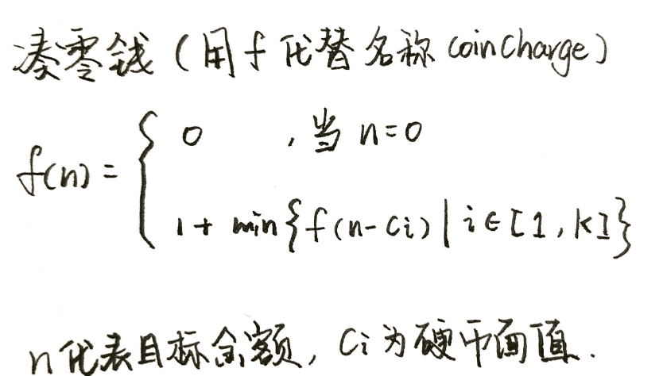
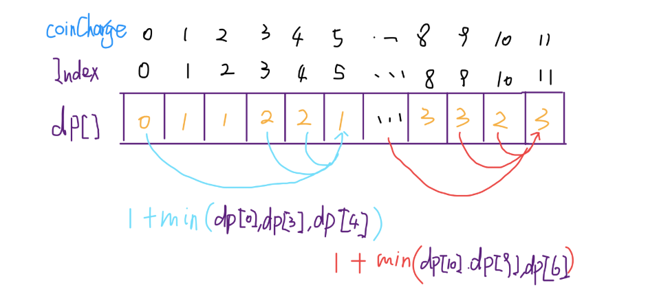

#### 322. 零钱兑换
- 给定不同面额的硬币 coins 和一个总金额 amount。编写一个函数来计算可以凑成总金额所需的最少的硬币个数。如果没有任何一种硬币组合能组成总金额，返回 -1。
- 示例 1:
```
输入: coins = [1, 2, 5], amount = 11
输出: 3 
解释: 11 = 5 + 5 + 1
```

- 示例 2:
```
输入: coins = [2], amount = 3
输出: -1
```
- 说明:
- 你可以认为每种硬币的数量是无限的。

#### 状态转移方程


#### 递归树


#### 动态规划列表值


#### 参考资料
- [动态规划套路详解](https://leetcode-cn.com/problems/coin-change/solution/dong-tai-gui-hua-tao-lu-xiang-jie-by-wei-lai-bu-ke/)