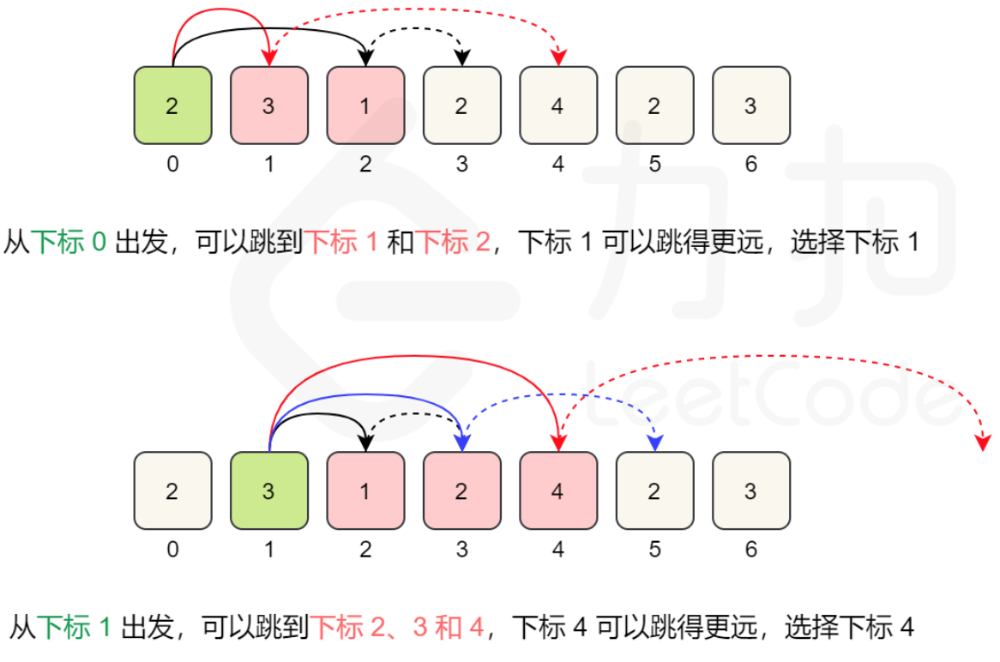

#### 45. 跳跃游戏 II
- 给定一个非负整数数组，你最初位于数组的第一个位置。
- 数组中的每个元素代表你在该位置可以跳跃的最大长度。
- 你的目标是使用最少的跳跃次数到达数组的最后一个位置。
- 示例:
    ```
    输入: [2,3,1,1,4]
    输出: 2
    解释: 跳到最后一个位置的最小跳跃数是 2。
         从下标为 0 跳到下标为 1 的位置，跳 1 步，然后跳 3 步到达数组的最后一个位置。
    ```
- 说明:
  - 假设你总是可以到达数组的最后一个位置。

- 图例
  - 
  - 


#### 参考资料
- [经典贪心算法：跳跃游戏](https://mp.weixin.qq.com/s/hMrwcLn01BpFzBlsvGE2oQ)
- [跳跃游戏 II](https://leetcode-cn.com/problems/jump-game-ii/solution/tiao-yue-you-xi-ii-by-leetcode-solution/)
- [详细通俗的思路分析，多解法](https://leetcode-cn.com/problems/jump-game-ii/solution/xiang-xi-tong-su-de-si-lu-fen-xi-duo-jie-fa-by-10/)