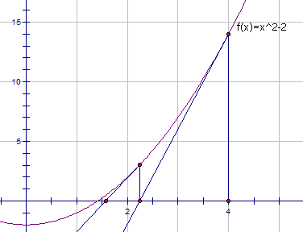

#### 69. x 的平方根
- 实现 int sqrt(int x) 函数。
- 计算并返回 x 的平方根，其中 x 是非负整数。
- 由于返回类型是整数，结果只保留整数的部分，小数部分将被舍去。
- 示例 1:
```
输入: 4
输出: 2
```

- 示例 2:
```
输入: 8
输出: 2
说明: 8 的平方根是 2.82842..., 
     由于返回类型是整数，小数部分将被舍去。
```
##### 题解
###### 二分法([来源](https://leetcode-cn.com/problems/sqrtx/solution/er-fen-cha-zhao-niu-dun-fa-python-dai-ma-by-liweiw/))
- 二分查找法应用于搜索平方根的思想很简单，其实就是“猜”，但是要有策略去猜，用“排除法”在有限的区间里，一次排除一半的区间元素，最后只剩下一个数
- 使用二分搜索平方根的思想很简单，就类似于小时候我们看的电视节目中“猜价格”游戏，高了就往低了猜，低了就往高了猜，范围越来越小。因此，使用二分法猜算数平方根就很自然
- 一个数的平方根肯定不会超过它自己，不过直觉还告诉我们，一个数的平方根最多不会超过它的一半
  - 例如8的平方根，8的一半是4， 4 ^ 2 = 16 > 8.如果这个数越大越是如此，因此我们要计算一下，这个边界是多少？
  - 解不等式： (a / 2) ^ 2 >= a
  - 意即：如果一个数的一半的平方大于它自己，那么这个数的取值范围。 解以上不等式得 a >= 4 或者 a <= 0
  - 于是边界值就是4，那么对0，1，2，3分别计算结果，很容易知道，这个4个数组的平方根依次是 0, 1, 1, 1

##### 牛顿迭代法([来源](https://leetcode-cn.com/problems/sqrtx/solution/niu-dun-die-dai-fa-by-loafer/))
- 求根号a的近似值：
  - 首先随便猜一个近似值x，然后不断令x等于x 和 a / x 的平均数，迭代个六七次后x的值就已经相当精确了
- 例如： 我想求根号2等于多少。假如我猜测的结果为4，虽然错的离谱，但你可以看见使用牛顿迭代法后这个值很快趋于根号2了
     ```
     ( 4 + 2/ 4 ) / 2 = 2.25

     ( 2.25 + 2/ 2.25 ) / 2 = 1.56944..

     ( 1.56944..+ 2/1.56944..) / 2 = 1.42189..

     ( 1.42189..+ 2/1.42189..) / 2 = 1.41423..
     ```
- 图解

     - 不断用(x, f(x)) 的切线来逼近方程 x^2 - a = 0的根
     - 根号a实际上就是 x ^ 2 - a = 0 的一个正实根，这个函数的导数是2x
     - 也就是，函数上任一点(x, f(x))处的切线斜率是2x
     - 那么，x - f(x) / (2x) 就是一个比x更接近的近似值
     - 代入 f(x) = x ^ 2 - a 得到 x - (x ^ 2  - a) / (2x), 也就是 (x + a / x ) / 2